````markdown
<div align="center">

# 🚀 SmartLedger AI

### 🔐 Smart Invoice Verification System using OCR, AI & Blockchain

**Transforming invoice verification from a manual process into an intelligent, secure and automated workflow.**

<p>
  
  
  
  
  
  
</p>

<p>
  <a href="#-about-the-project">About</a> •
  <a href="#-key-features">Features</a> •
  <a href="#-how-it-works">How It Works</a> •
  <a href="#-technology-stack">Technology</a> •
  <a href="#-project-structure">Structure</a> •
  <a href="#-installation">Installation</a> •
  <a href="#-future-scope">Future Scope</a>
</p>

</div>

---

## 🧠 About the Project

**SmartLedger AI** is an intelligent desktop-based **Smart Invoice Verification System** developed to simplify and secure the invoice verification process.

Traditional invoice verification often involves manual data entry, document inspection, duplicate checking and verification of invoice authenticity. These activities can consume significant time and may introduce human errors.

SmartLedger AI combines:

- 🔎 **OCR** for automatic invoice data extraction
- 🤖 **AI-based analysis** for suspicious and duplicate invoice detection
- ⛓️ **Blockchain-inspired hash verification** for maintaining invoice integrity
- 🔐 **Secure authentication** for employee access
- 📊 **Analytics** for monitoring invoice activity
- 📄 **Report generation** for business and verification records
- 🗄️ **MySQL** for persistent data storage

The goal is to provide a centralized platform where invoices can be uploaded, processed, validated, verified and monitored through an easy-to-use interface.

---

# 🎯 Why SmartLedger AI?

### The Problem

Manual invoice verification can involve:

```text
Invoice
   ↓
Manual Data Entry
   ↓
Manual Verification
   ↓
Duplicate Checking
   ↓
Fraud Investigation
   ↓
Record Keeping
````

This can result in:

* ⏳ Increased processing time
* ❌ Human errors
* 🔁 Duplicate invoices
* ⚠️ Difficulty identifying suspicious records
* 🔓 Weak document integrity controls
* 📚 Large amounts of manual record keeping

### The SmartLedger Approach

SmartLedger AI creates a more automated workflow:

```text
              📄 INVOICE
                  │
                  ▼
           🔎 OCR EXTRACTION
                  │
                  ▼
          📋 DATA VALIDATION
                  │
                  ▼
          🤖 AI ANALYSIS
                  │
            ┌─────┴─────┐
            ▼           ▼
        ✅ VERIFIED   ⚠️ SUSPICIOUS
            │           │
            └─────┬─────┘
                  ▼
          ⛓️ HASH / BLOCKCHAIN
             VERIFICATION
                  │
                  ▼
           📊 DASHBOARD
                  │
                  ▼
          📄 REPORT GENERATION
```

---

# ✨ Key Features

## 🔐 Secure Authentication

SmartLedger AI provides an employee authentication system with:

* Employee registration
* Secure login
* Password hashing
* Role-based access
* Employee/Admin portal separation
* Password visibility control

---

## 📄 Invoice Management

Users can manage invoice records through the application.

### Supported operations include:

* Upload invoice
* View invoices
* Search invoice records
* Manage invoice information
* View invoice details
* Validate invoice information

---

## 🔎 OCR Invoice Extraction

The OCR module automatically extracts information from invoice documents.

### Example:

```text
Invoice Image
      ↓
OCR Engine
      ↓
Text Extraction
      ↓
Invoice Parser
      ↓
Structured Invoice Data
```

Important information can include:

| Field          | Example          |
| -------------- | ---------------- |
| Invoice Number | INV-2026-001     |
| Vendor         | ABC Technologies |
| Date           | 2026-09-20       |
| Amount         | ₹25,000          |

This reduces the need for manual data entry.

---

# 🤖 AI Fraud Detection

The system analyzes invoice information to help identify potentially suspicious records.

The fraud detection workflow can consider factors such as:

* Duplicate invoice information
* Similar invoice records
* Suspicious invoice values
* Validation results
* Existing invoice records

The dashboard provides a clear indication of:

```text
🟢 Verified
🔴 Fraud / Suspicious
```

---

# ⛓️ Blockchain Integrity Verification

One of the key security components of SmartLedger AI is its blockchain-inspired verification mechanism.

Each blockchain record maintains a relationship with the previous record using cryptographic hashes.

### Example

```text
┌─────────────────────────┐
│        BLOCK 1          │
│                         │
│ Invoice ID              │
│ Current Hash            │
│ Previous Hash = 0       │
└────────────┬────────────┘
             │
             ▼
┌─────────────────────────┐
│        BLOCK 2          │
│                         │
│ Invoice ID              │
│ Previous Hash = Hash 1  │
│ Current Hash            │
└────────────┬────────────┘
             │
             ▼
┌─────────────────────────┐
│        BLOCK 3          │
│                         │
│ Invoice ID              │
│ Previous Hash = Hash 2  │
│ Current Hash            │
└─────────────────────────┘
```

If the relationship between blocks does not match, the system can detect a possible integrity problem.

---

# 🔑 What is the Hash?

A **hash** is a cryptographic representation of data.

SmartLedger AI uses hashing to create a unique digital representation of invoice/block information.

Conceptually:

```text
Invoice Data
     +
Previous Hash
     +
Timestamp
     ↓
 SHA-256
     ↓
Current Hash
```

A change in the underlying information results in a different hash.

This helps the application detect unauthorized modification of stored blockchain records.

---

# 📊 Analytics Dashboard

The dashboard provides a centralized overview of invoice activity.

### Dashboard metrics include:

```text
┌─────────────────┐
│ Total Invoices  │
│       6         │
└─────────────────┘

┌─────────────────┐
│ Verified        │
│       2         │
└─────────────────┘

┌─────────────────┐
│ Fraud Detected  │
│       4         │
└─────────────────┘

┌─────────────────┐
│ Blockchain      │
│ Blocks          │
│       2         │
└─────────────────┘
```

The dashboard also provides:

* Recent invoice records
* Invoice status
* Vendor information
* Amount
* Invoice date
* Quick actions

---

# 📈 Reports

The reporting module provides a way to generate and view invoice-related reports.

The project includes support for report generation using technologies/libraries integrated into the application.

Possible report formats include:

* 📄 PDF
* 📊 Excel
* 📋 CSV

---

# 👁️ Invoice Preview

The application includes an invoice preview interface that allows users to inspect invoice information through the application before or after verification.

---

# 🗄️ Database

SmartLedger AI uses **MySQL** for persistent storage.

### Main database tables

```text
smart_invoice
│
├── users
│
├── invoice
│
├── ocr_results
│
└── blockchain
```

### Users

Stores employee authentication and profile information.

```text
user_id
full_name
email
password
phone
role
created_at
```

### Invoice

Stores invoice information.

```text
invoice_id
invoice_number
vendor_name
invoice_date
amount
file_name
file_path
status
created_at
```

### OCR Results

Stores extracted OCR information.

### Blockchain

Stores blockchain verification records and hash relationships.

---

# 🏗️ System Architecture

SmartLedger AI follows a modular layered architecture.

```text
                 ┌──────────────────────┐
                 │     User Interface   │
                 │      Java Swing      │
                 └──────────┬───────────┘
                            │
                            ▼
                 ┌──────────────────────┐
                 │    Service Layer     │
                 │ Authentication       │
                 │ OCR                  │
                 │ Fraud Detection      │
                 │ Blockchain           │
                 └──────────┬───────────┘
                            │
                            ▼
                 ┌──────────────────────┐
                 │       DAO Layer      │
                 │   JDBC / Database    │
                 └──────────┬───────────┘
                            │
                            ▼
                 ┌──────────────────────┐
                 │        MySQL         │
                 │      Database        │
                 └──────────────────────┘
```

---

# 🧩 Technology Stack

## Programming Language

**Java 17**

## User Interface

**Java Swing**

## Database

**MySQL**

## Database Connectivity

**JDBC**

## Build Tool

**Apache Maven**

## OCR

OCR technology integrated into the project for invoice text extraction.

## Security

* Password hashing
* SHA-256 cryptographic hashing
* Role-based authentication
* Blockchain-style integrity verification

## Reporting

* PDF reporting
* Excel reporting
* CSV reporting

---

# 📁 Project Structure

```text
SmartInvoiceVerification
│
├── src
│   └── main
│       │
│       ├── java
│       │   └── com.smartinvoice
│       │       │
│       │       ├── auth
│       │       ├── blockchain
│       │       ├── charts
│       │       ├── config
│       │       ├── dao
│       │       ├── fraud
│       │       ├── model
│       │       ├── ocr
│       │       ├── parser
│       │       ├── report
│       │       ├── service
│       │       ├── ui
│       │       ├── utils
│       │       └── validation
│       │
│       └── resources
│           ├── backgrounds
│           ├── css
│           ├── icons
│           ├── images
│           └── invoices
│
├── pom.xml
├── .gitignore
└── README.md
```

---

# 🚀 Application Workflow

The complete workflow can be represented as:

```text
                    START
                      │
                      ▼
               🔐 Employee Login
                      │
                      ▼
              📄 Upload Invoice
                      │
                      ▼
                 🔎 OCR
                      │
                      ▼
              📋 Extract Data
                      │
                      ▼
                ✅ Validation
                      │
                      ▼
               🤖 AI Analysis
                      │
             ┌────────┴────────┐
             ▼                 ▼
        ✅ VERIFIED        ⚠️ SUSPICIOUS
             │                 │
             └────────┬────────┘
                      ▼
              ⛓️ Blockchain
                Verification
                      │
                      ▼
                📊 Dashboard
                      │
                      ▼
                 📄 Reports
                      │
                      ▼
                     END
```

---

# 🛠️ Installation

## Prerequisites

Install the following:

* Java JDK 17+
* IntelliJ IDEA
* MySQL Server
* Maven

---

## 1. Clone the Repository

```bash
git clone https://github.com/YOUR_USERNAME/smartledger-ai.git
```

Move into the project:

```bash
cd smartledger-ai
```

---

## 2. Open in IntelliJ IDEA

Open the cloned project in IntelliJ IDEA.

Allow Maven to download the required dependencies.

---

## 3. Create the Database

Open MySQL and create:

```sql
CREATE DATABASE smart_invoice;
```

Create the required tables according to the database schema included with the project.

---

## 4. Configure Database Password

The project does **not** store the database password directly in the source code.

Set the following environment variable:

```text
SMARTLEDGER_DB_PASSWORD
```

In IntelliJ IDEA:

```text
Run
 ↓
Edit Configurations
 ↓
Environment Variables
 ↓
SMARTLEDGER_DB_PASSWORD=YOUR_PASSWORD
```

---

## 5. Run the Application

Run the main class:

```text
Main.java
```

The application should start with the SmartLedger AI interface.

---

# 🔐 Security

Sensitive configuration values are intentionally excluded from the GitHub repository.

The project uses:

```text
Environment Variables
        ↓
Database Credentials
        ↓
JDBC Connection
```

This prevents database passwords from being directly stored in the source code.

---

## 📸 Application Screenshots

### 🔐 Employee Login

<p align="center">
  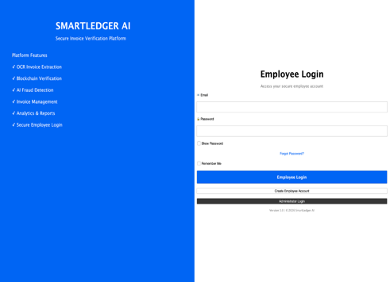
</p>

---

### 📝 Employee Registration

<p align="center">
  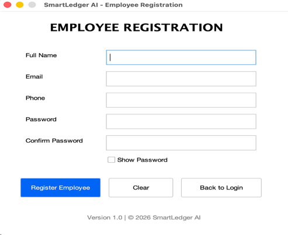
</p>

---

### 🏠 SmartLedger AI Dashboard

<p align="center">
  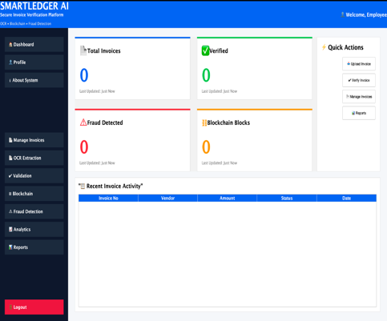
</p>

---

### 📤 Upload Invoice

<p align="center">
  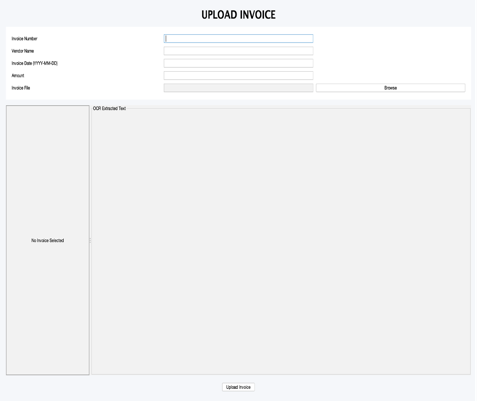
</p>

---

### 🔎 OCR Invoice Extraction

<p align="center">
  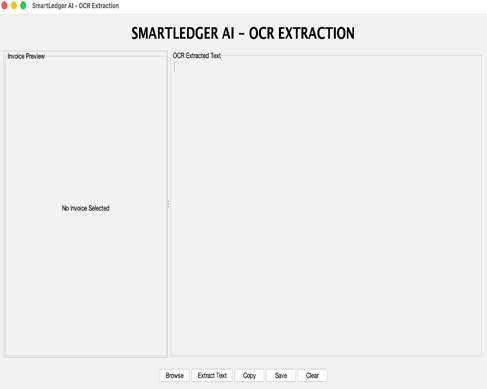
</p>

---

### 🧾 Invoice Management

<p align="center">
  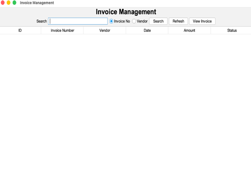
</p>

---

### ⛓️ Blockchain Verification

<p align="center">
  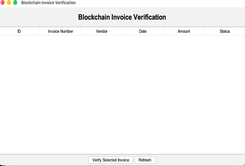
</p>

---

### 🛡️ AI Fraud Detection

<p align="center">
  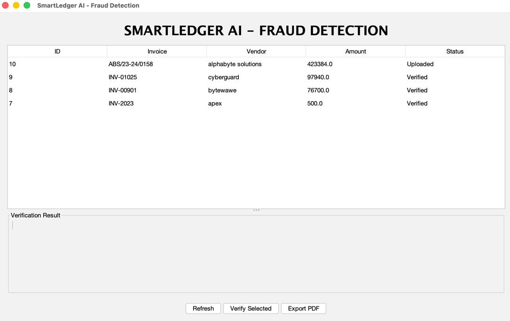
</p>

---

### 📊 Analytics Dashboard

<p align="center">
  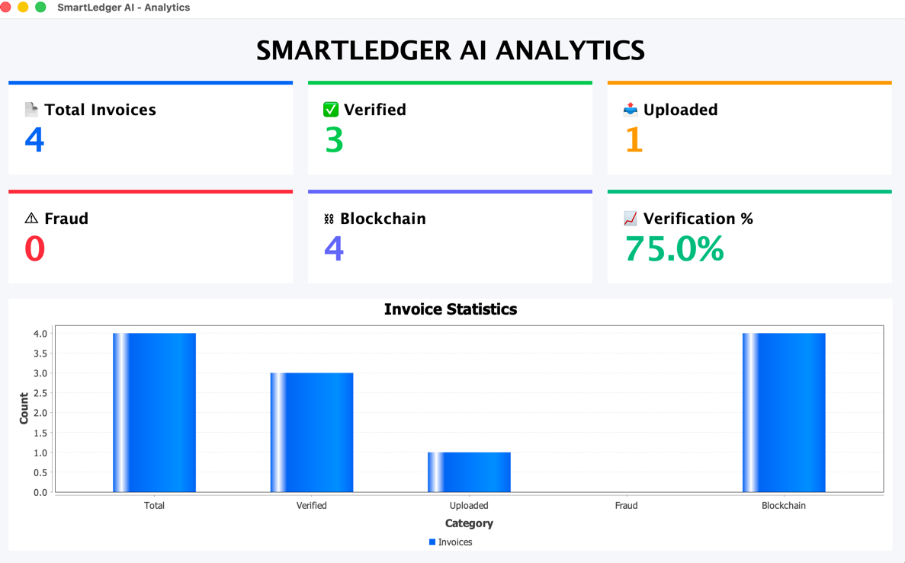
</p>

---

### 📑 Reports

<p align="center">
  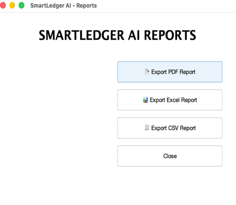
</p>

---

### 👤 User Profile

<p align="center">
  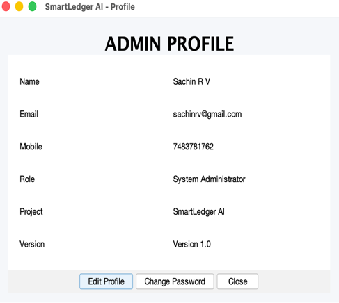
</p>

---

### 🔑 Administrator Login

<p align="center">
  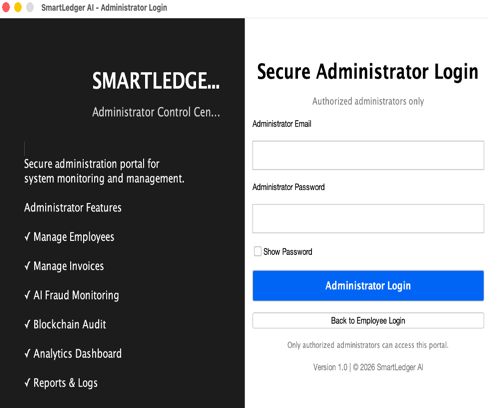
</p>

---

### ℹ️ About System

<p align="center">
  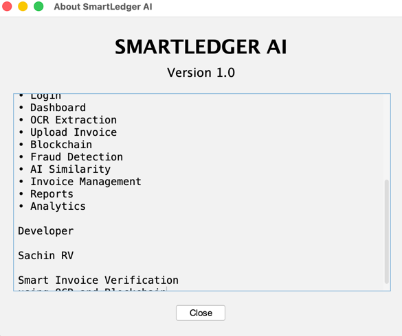
</p>

The project currently includes an **Administrator Login interface**.

The complete administrator management portal is planned as a future enhancement.

Future administrator capabilities can include:

```text
Administrator
      │
      ├── 👥 Manage Employees
      ├── 📄 Manage Invoices
      ├── 📊 Analytics
      ├── ⚠️ Fraud Monitoring
      ├── 📑 Reports
      └── ⛓️ Blockchain Audit
```

---

# 🌱 Future Scope

SmartLedger AI can be extended with several advanced capabilities.

### ☁️ Cloud Deployment

Deploy the system on cloud infrastructure for remote access and centralized management.

### 🤖 Advanced Machine Learning

Train machine learning models using historical invoice data to improve fraud detection.

### 📱 Mobile Application

Develop Android and iOS applications for mobile invoice verification.

### 📧 Automated Notifications

Send email/SMS notifications when invoices are verified or flagged.

### 🔗 QR Code Verification

Generate QR codes for invoices and allow instant authenticity verification.

### ✍️ Digital Signatures

Integrate digital signature verification for stronger document authenticity.

### 🏢 Multi-Organization Support

Allow multiple companies and departments to securely use the same platform.

### 🔌 ERP Integration

Provide REST APIs for integration with ERP, accounting and enterprise systems.

### 👨‍💼 Advanced Administrator Portal

Implement complete administrative functionality including:

* User management
* Role management
* Invoice management
* System monitoring
* Audit logs
* Security controls

---

# 🎓 Academic Project

**Project:** SmartLedger AI
**Title:** Smart Invoice Verification System using OCR, AI and Blockchain

**Developed By:**

### Sachin RV

**Program:** MCA

---

# ⭐ Project Highlights

```text
🔎 OCR
   ↓
Extract invoice information

🤖 AI
   ↓
Analyze suspicious invoices

⛓️ Blockchain
   ↓
Verify data integrity

🔐 Security
   ↓
Protect user access

📊 Analytics
   ↓
Understand invoice activity

📄 Reports
   ↓
Generate useful records
```

---

# 📌 Project Status

### 🟢 Core System Implemented

The current version includes the major invoice verification workflow,
authentication, OCR processing, invoice management, fraud detection,
blockchain verification, analytics and reporting components.

### 🔵 Future Development

The administrator management portal and additional enterprise-level
features can be developed in future versions.

---

<div align="center">

## 🚀 SmartLedger AI

### Making Invoice Verification Smarter, Safer and More Automated.

**Built with Java • MySQL • OCR • AI • Blockchain**

⭐ If you find this project interesting, consider giving the repository a star!

</div>
```
